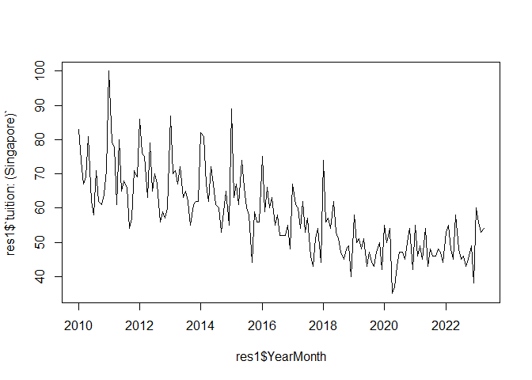
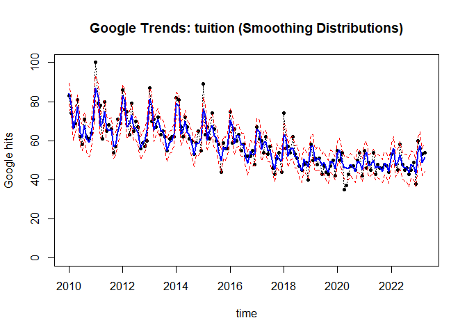
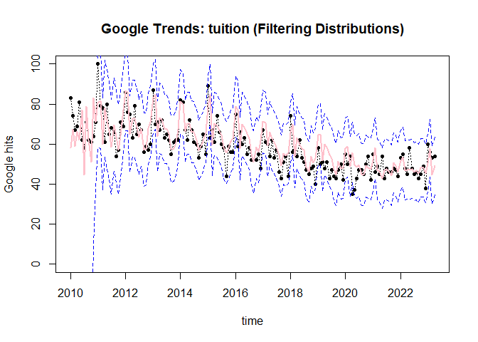
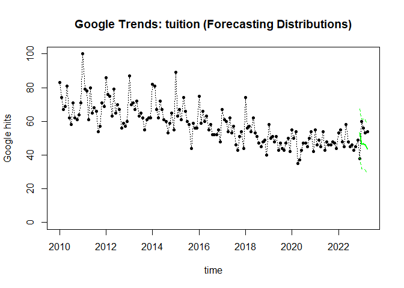

\urlstyle{tt}

## Abstract

<!--  -->

According to the Household Expenditure Survey (HES) conducted from 2017 to 2018 by the Singapore Department of Statistics (DOS), households in Singapore on average spend S\$112 per month on private tuition and other educational courses. Furthermore, household consumption expenditure on education in Singapore rose by 84% between 2010 and 2021. In light of the burgeoning tuition industry in Singapore, this project investigated whether there has been a similar increasing trend in the monthly frequency of Google searches in Singapore for the term "tuition" since 2010. The main goal was to identify any polynomial trends in Google searches for this term, as well as any seasonal components. Based on observations of the Google Trends data extracted, we conjectured that the normalized frequency of monthly searches for "tuition" follows a linearly decreasing trend with a seasonal component of period 12 months. 

We built a model consisting of a polynomial trend of order one as well as a seasonal component with period 12 months. It was assumed that the observational noise followed a normal distribution with mean 0 and constant but unknown variance $v$. The system covariance matrix was also assumed to be unknown and specified via discount factors. We then carried out a Bayesian analysis to obtain the filtering, smoothing and forecasting distributions under our model. The plot of the means of the smoothing distribution exhibited, in agreement with the plot of the actual data, quasi-periodic behaviour together with a decreasing trend. The plot of the means of the filtering distribution showed a similar trend, though it was generally less smooth than the corresponding plot for the smoothing distribution. The last 5 observations of the dataset were reserved for prediction; with respect to the given model, the mean square error of the forecast function was found to be approximately 42.8, compared to the approximate variance of 136 of the entire dataset. We concluded that the model consisting of a linearly decreasing trend and a seasonal component with period 12 months and  4 harmonics fitted the data fairly well.  

## Introduction

Given that Singapore household expenditure on tuition grew from S$1.1 billion in 2012/2013 to S\$1.4 billion in 2017/2018, we were interested in finding out whether
there has been a similar increase in monthly frequency of Google searches for "tuition". An inspection of a plot of the data revealed that, despite the overall increase in household expenditure on tuition since 2010, there has been a general decline in monthly searches for the term "tuition". Monthly searches for this term also display quasi-periodic behaviour, typically peaking near the start of the year and then bottoming out near the start of the fourth quarter of the year. An intermediate goal of this project was to determine how well a model consisting of a polynomial trend and a seasonal component fitted the data, and to choose the optimal order of the polynomial component and the optimal number of harmonics for the seasonal component. We proposed a model consisting of a linear trend and a seasonal component with period 12.  After experimenting with various choices of harmonics, we selected 3 additional harmonics for a total of 4 frequencies: $\omega_1 = \frac{2\pi}{12}$, $\omega_2 = \frac{2\pi}{6}$, $\omega_3 = \frac{2\pi}{4}$ and $\omega_4 = \frac{2\pi}{3}$.            

## Data Description and Exploratory Data Analysis

The following graph plots the normalized frequency of Google searches for the term "tuition" versus date.

<!-- -->

The graph appears to follow a quasi-periodic and decreasing trend. Based on these graph properties, we postulated a model with a linear trend and a seasonal component of period 12. To justify the seasonal component, we reasoned that demand for tuition might peak around the start of the new school year and then taper off just before the national examinations, which are usually held during the fourth quarter of the year (the primary school national examinations are typically held around the first week of October, while the secondary and post-secondary national examinations are typically held around November). We suggest that, despite the overall increase in household expenditure on tuition over the past decade, the decreasing trend in monthly Google searches for "tuition" might be explained by the fact that student enrolment in primary and secondary schools has generally been declining over the past decade due to the falling birth rate of Singapore.      

## Building the NDLM and Performing Bayesian Analysis

As explained earlier, the plot of the observed data suggested a model consisting of a polynomial component and a seasonal component. To keep the model simple, we adopted a linear trend component. The period of the seasonal component was set as 12 months, reflecting the varying levels of demand for tuition throughout each academic year. The dataset contained 160 observations of normalized monthly Google searches for "tuition", starting from January 2010 and ending on April 2023. The model was fitted to the first 155 observations, while the last 5 observations were used to assess the accuracy of the forecast function. The observational variance was assumed to be constant but unknown, its conditional prior distribution following an inverse Gamma distribution with one degree of freedom and the prior estimate of the observational variance equal to 500. The system covariance was also assumed to be unknown, and was specified via a discount factor in the range $(0.7, 1]$ by using the mean squared errors of the forecast values as the criterion for selecting the discount value. Based on this criterion, the optimal discount value was found to be 0.93. The parameter vector $\bf{\theta_t}$, which has length 9 - one parameter for the linear component and 8 for the seasonal component, was assumed to have a normally distributed prior with mean 

$\begin{bmatrix}58.13125 & 0 & 0 & 0 & 0 & 0 & 0 & 0 & 0\end{bmatrix}^T$

and covariance matrix equal to $10\cdot I_9$. The prior estimate  of 58.13125 for the mean of the linear component parameter was obtained from the mean of the dataset.         

After fully specifying the model and setting up the prior distributions of the state parameter and observational variance conditioned on the initial data, we performed a Bayesian analysis to derive the filtering, smoothing and forecasting distributions. The first graph shows a plot of the actual observations (as black circles) and a plot of the mean values of the smoothing distributions (in blue) together with the corresponding 95% credible intervals (in red).

<!-- -->

The second graph shows a plot of the actual observations (as black circles) and a plot of the mean values of the filtering distributions (in pink) together with the corresponding 95% credible intervals (in blue).

<!-- -->

Finally, the third graph shows a plot of the actual observations (as black circles) and a plot of the means of the forecasting distributions (in green) together with the corresponding 95% credible intervals (in green).  

<!-- -->

## Conclusion

Perhaps not surprisingly, the plot of the means of the smoothing distributions was smoother than the corresponding plot for the filtering distributions. The size of the 95% credible intervals for the forecasting distributions also appeared to increase as the number of steps ahead increased, indicating an increase in uncertainty. The mean squared errors for the smoothing, filtering and forecasting distributions were, respectively, 17.03985, 63.00045 and 42.76996. We conclude that the model consisting of a linearly decreasing trend and a seasonal component with period 12 months and  4 harmonics appears to fit the data to some extent. That is to say, Google searches for the term "tuition" in Singapore do appear to have been declining since 2010 and follow a seasonal trend with a fundamental period of 12 months. However, one limitation of this model is that the coefficient matrices $F_t$ and $G_t$ are assumed to be constant over time. We also assumed that the observation variance and the system covariance are independent of each other, which may not hold in practice.   
